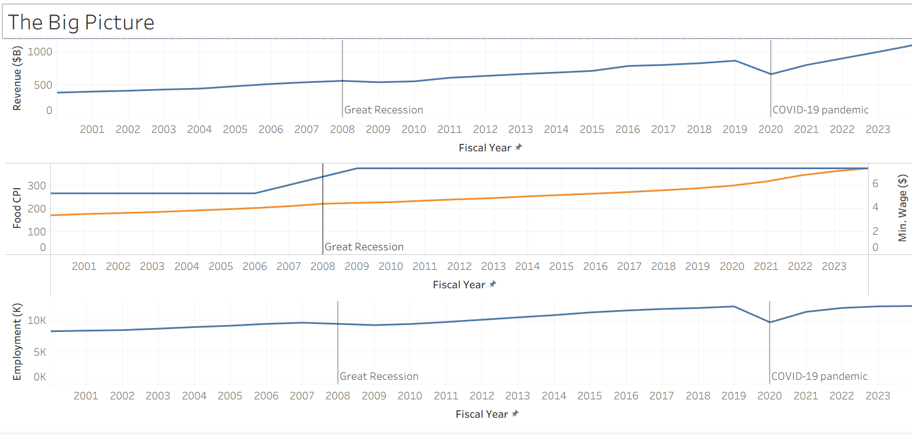
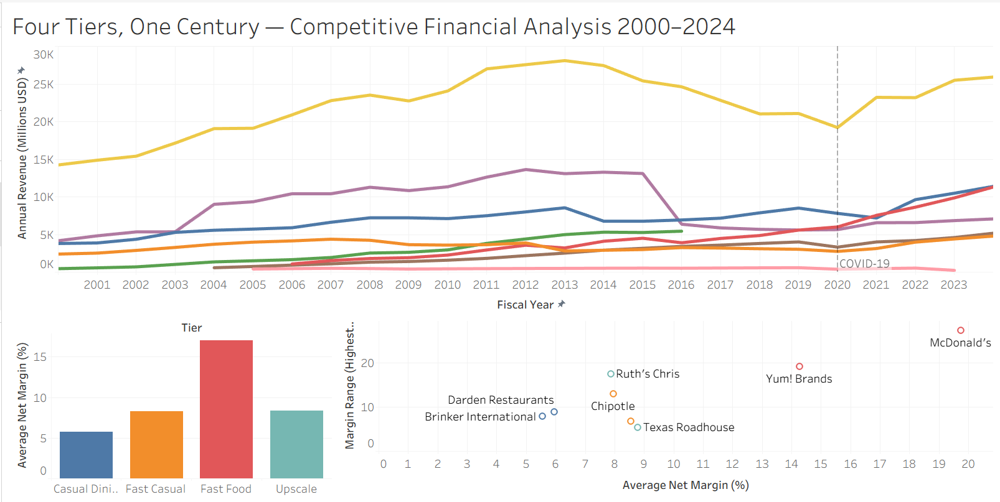
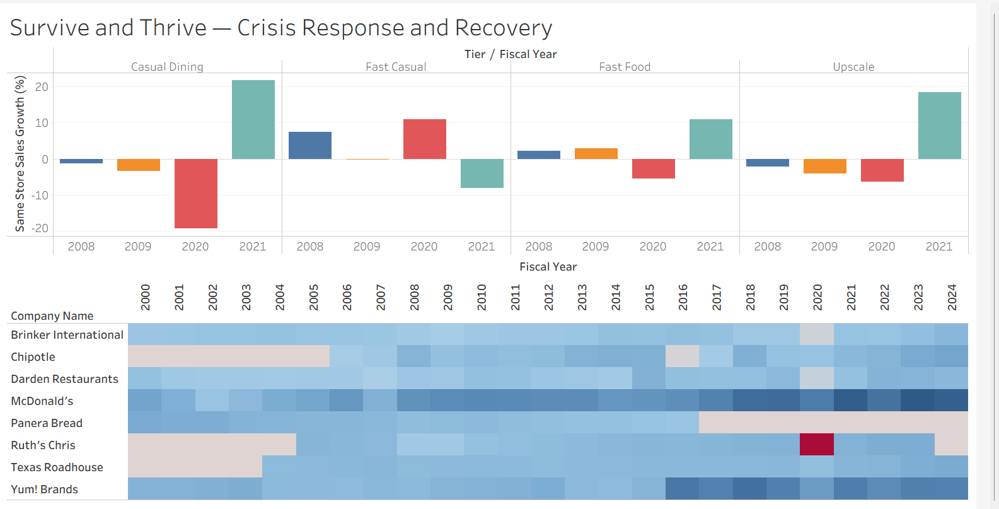

# 🍽️ Four Tiers, One Century: U.S. Restaurant Industry Analysis
### Project 4 of 5 | Tools: Google Sheets · SQLite · Tableau Public

A 25-year financial analysis of eight publicly traded restaurant companies across four
market tiers — fast food, fast casual, casual dining, and upscale. Built with Google
Sheets, SQLite, and Tableau Public to examine revenue, margins, same store sales, and
location growth from 2000–2024 — revealing how each tier survived recession, disruption,
and a global pandemic.

---

## Tools Used
| Tool | Purpose |
|---|---|
| Google Sheets | Data collection, cleaning, and relational table structuring |
| SQLite | Database storage and querying |
| DB Browser for SQLite | SQL query interface |
| Tableau Public | Interactive dashboards and visualizations |

---

## The Story

### Dashboard 1 — The Big Picture
The industry crossed $1 trillion in annual revenue for the first time in 2024 — but
the path there was anything but smooth. Two recessions, a pandemic, a frozen minimum
wage, and relentless food price inflation all left their mark. This dashboard sets the
macro stage before zooming into individual companies. The dual-axis CPI vs minimum wage
chart is the sleeper hit — food prices rose 65% since 2009 while the federal minimum
wage hasn't moved a dollar.



---

### Dashboard 2 — Four Tiers, One Century
Eight companies, four tiers, 25 years. The revenue line chart shows McDonald's
dominating from above, Chipotle climbing from nothing, Panera going dark after 2016,
and Yum!'s cliff drop marking the China spinoff. The scatter plot is the centerpiece —
positioning every company by average margin vs margin volatility reveals Texas Roadhouse
as the quiet outlier: consistently profitable in a way nobody else in the dataset
comes close to matching.



---

### Dashboard 3 — Survive and Thrive
This is where COVID hits the data. The grouped bar chart isolates four key years —
2008, 2009, 2020, 2021 — showing each tier's same store sales response to crisis and
recovery. Casual dining dropped -19.3% in 2020 then bounced back +22% in 2021. Fast
casual grew during the pandemic. The heat map below tells the full 25-year margin story
by company — with Ruth's Chris 2020 appearing as a vivid red square against an otherwise
blue field. The sharpest single data point in the project.



---

## Project Structure
```
restaurant-industry-analysis/
├── data/
│   └── Restraunt_25_year_Analysis_CLEAN.xlsx
├── sql/
│   └── restaurant_analysis_queries.sql
├── images/
│   ├── dashboard1_big_picture.png
│   ├── dashboard2_four_tiers.png
│   └── dashboard3_survive_thrive.png
├── Restaurant_Analysis.twbx
└── README.md
```

---

## Companies Analyzed
| Company | Ticker | Tier | Public Data Window |
|---|---|---|---|
| McDonald's | MCD | Fast Food | 2000–2024 |
| Yum! Brands | YUM | Fast Food | 2000–2024 |
| Chipotle | CMG | Fast Casual | 2006–2024 |
| Panera Bread | PNRA | Fast Casual | 2000–2016 |
| Darden Restaurants | DRI | Casual Dining | 2000–2024 |
| Brinker International | EAT | Casual Dining | 2000–2024 |
| Texas Roadhouse | TXRH | Upscale | 2004–2024 |
| Ruth's Chris | RUTH | Upscale | 2005–2022 |

---

## Data Sources
| Metric | Source | Years Available |
|---|---|---|
| Company Financials | SEC 10-K / Macrotrends.net | 2000–2024 |
| Food CPI (CUUR0000SEFV) | Bureau of Labor Statistics | 2000–2024 |
| Restaurant Employment (CEU7072200001) | Bureau of Labor Statistics | 2000–2024 |
| GDP Growth | Federal Reserve Economic Data (FRED) | 2000–2024 |
| Industry Revenue | National Restaurant Association | 2000–2024 |

> **Note on methodology:** Same store sales for Yum! reflects Taco Bell flagship only;
> Brinker reflects Chili's only; Darden reflects Olive Garden only. Labor cost data
> only available for operator-owned companies — franchise models do not carry food or
> labor costs on their books directly. Panera data ends 2016 (went private). Ruth's
> Chris data ends 2022 (acquired by Dine Brands). Yum! 2016 revenue drop reflects
> China spinoff, not operational decline. Darden 2014 revenue drop reflects Red Lobster
> divestiture.

---

## Interactive Dashboards
👉 **[View on Tableau Public](https://public.tableau.com/app/profile/bryce.gardner/vizzes)**

---

## SQL Queries Included
| Query | Description |
|---|---|
| 01 | Sanity check — verify joins across all three tables |
| 02 | Average net margin by tier across full dataset |
| 03 | COVID impact by tier — 2019 vs 2020 revenue comparison |
| 04 | Best performing company by average net margin with range |
| 05 | Same store sales by tier during key economic events |
| 06 | Location growth by decade per company |
| 07 | Three-table macro context join — revenue vs inflation vs GDP |
| 08 | Consistency scoring — margin range and years above 8% |

---

## Key Findings
- Fast casual was the **only tier to grow revenue during COVID** (+7.6% in 2020), driven by Chipotle's digital ordering infrastructure
- Casual dining same store sales dropped **-19.3% in 2020** — nearly four times worse than fast food at -5.6%
- Texas Roadhouse maintained a net margin range of just **5.39 percentage points across 21 years**, exceeding 8% margins in 19 of those years
- The federal minimum wage has been **frozen at $7.25 since 2009** while food away from home CPI rose 65% over the same period
- McDonald's net margin improved from **13.9% in 2000 to 31.7% in 2024**, reflecting aggressive franchise model conversion
- Ruth's Chris posted a **-5.91% net margin in 2020** — the only company in the dataset to go negative

---

## Author
Bryce Gardner
- GitHub: [brycegardner90](https://github.com/brycegardner90)
- LinkedIn: [Bryce Gardner](https://www.linkedin.com/in/bryce-gardner-16a889183)

---

## Portfolio Navigation

| Project | Topic | Tools |
|---|---|---|
| [Project 1 — Video Game Sales Analysis](https://github.com/brycegardner90/video-game-sales-analysis) | Global video game sales trends (1980–2020) | SQL · Power BI |
| [Project 2 — NFL Penalty Bias Analysis](https://github.com/brycegardner90/nfl-penalty-analysis) | Do certain NFL teams get more blown calls? | Python · SQL · Power BI |
| [Project 3 — Atlanta Rising](https://github.com/brycegardner90/Atlanta-Rising-A-Century-of-Growth) | Atlanta's century of economic & demographic growth | Python · SQLite · Power BI |
| **Project 4 — Four Tiers, One Century** *(you are here)* | U.S. restaurant industry financial analysis 2000–2024 | Google Sheets · SQLite · Tableau |
| Project 5 — Coming Soon | Financial Analysis Capstone | TBD |
